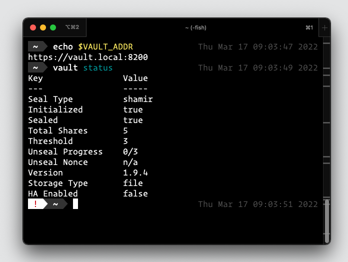

# vault-demo

[](https://github.com/kristinjeanna/vault-demo/blob/main/LICENSE) 

A simple [Vault](https://www.vaultproject.io/) server with a more prod-like configuration than the `-dev` server.

- [How to set up](#how-to-set-up)

## How to set up

1. Clone the repo.

2. Run the `generate-cert.sh` script to generate a certificate in the `generated/` directory. The script requires 1 argument, the host name of the server, such as `vault.local`. Localhost or `127.0.0.1` can also be used.

    ```shell
    ./generate-cert vault.local
    ```

3. If you used a host name in step #2, add an entry to your system's hosts file so that the name resolves properly.

4. Set the following environment variables in the manner appropriate for your shell.

   ```shell
   export VAULT_ADDR=https://vault.local:8200
   export VAULT_SKIP_VERIFY=true
   ```

   *Note: the skip verify is needed since we're using a self-signed certificate.*

5. Launch the Vault server.

    ```shell
    docker-compose up -detach
    ```

    *Note: omit the `-detach` flag if you wish not to run the Vault server in detached mode.*

6. Check the Vault server's status.

   
